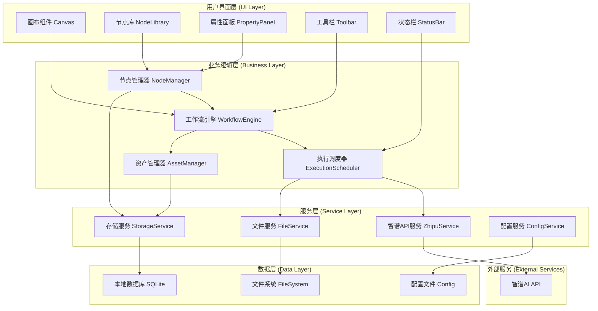
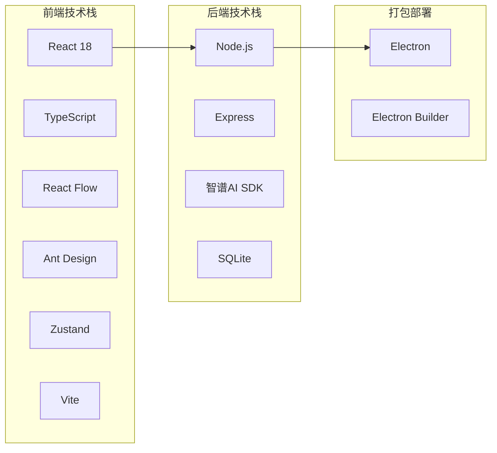
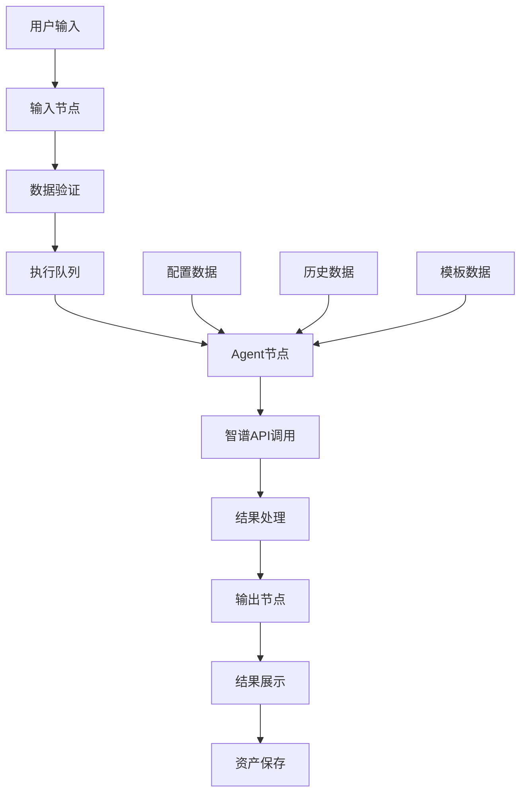

# AidCreater 系统架构设计文档 (DESIGN)

## 1. 整体架构设计

### 1.1 系统架构图



### 1.2 技术架构栈



## 2. 分层设计详述

### 2.1 用户界面层 (UI Layer)

**画布组件 (Canvas)**
- 基于React Flow实现
- 支持节点拖拽、缩放、平移
- 处理节点连接和布局
- 实时渲染工作流状态

**节点库 (NodeLibrary)**
- 提供可拖拽的节点模板
- 支持节点分类和搜索
- 动态加载节点定义

**属性面板 (PropertyPanel)**
- 显示选中节点的详细信息
- 提供节点配置和编辑功能
- 支持实时预览和验证

**工具栏 (Toolbar)**
- 工作流操作按钮（运行、停止、保存）
- 画布操作工具（缩放、对齐、清空）
- 导入导出功能

### 2.2 业务逻辑层 (Business Layer)

**工作流引擎 (WorkflowEngine)**
```typescript
class WorkflowEngine {
  private nodes: Map<string, Node>;
  private edges: Map<string, Edge>;
  private executionContext: ExecutionContext;
  
  async executeWorkflow(workflowId: string): Promise<ExecutionResult> {
    // 工作流执行逻辑
  }
  
  validateWorkflow(workflow: Workflow): ValidationResult {
    // 工作流验证逻辑
  }
  
  getExecutionPlan(workflow: Workflow): ExecutionPlan {
    // 生成执行计划
  }
}
```

**节点管理器 (NodeManager)**
```typescript
class NodeManager {
  private nodeTypes: Map<string, NodeType>;
  private nodeInstances: Map<string, NodeInstance>;
  
  createNode(type: string, config: NodeConfig): Node {
    // 创建节点实例
  }
  
  updateNode(nodeId: string, data: Partial<NodeData>): void {
    // 更新节点数据
  }
  
  deleteNode(nodeId: string): void {
    // 删除节点
  }
}
```

**执行调度器 (ExecutionScheduler)**
```typescript
class ExecutionScheduler {
  private executionQueue: ExecutionTask[];
  private runningTasks: Map<string, ExecutionTask>;
  
  async scheduleExecution(task: ExecutionTask): Promise<void> {
    // 调度执行任务
  }
  
  cancelExecution(taskId: string): void {
    // 取消执行
  }
  
  getExecutionStatus(taskId: string): ExecutionStatus {
    // 获取执行状态
  }
}
```

### 2.3 服务层 (Service Layer)

**智谱API服务 (ZhipuService)**
```typescript
class ZhipuService {
  private client: ZhipuAI;
  private rateLimiter: RateLimiter;
  
  async generateContent(prompt: string, options: GenerationOptions): Promise<string> {
    // 调用智谱API生成内容
  }
  
  async streamGenerate(prompt: string, callback: StreamCallback): Promise<void> {
    // 流式生成内容
  }
  
  validateApiKey(apiKey: string): Promise<boolean> {
    // 验证API密钥
  }
}
```

**存储服务 (StorageService)**
```typescript
class StorageService {
  private db: Database;
  
  async saveWorkflow(workflow: Workflow): Promise<string> {
    // 保存工作流
  }
  
  async loadWorkflow(workflowId: string): Promise<Workflow> {
    // 加载工作流
  }
  
  async saveAsset(asset: Asset): Promise<string> {
    // 保存资产
  }
  
  async searchAssets(query: AssetQuery): Promise<Asset[]> {
    // 搜索资产
  }
}
```

## 3. 核心组件设计

### 3.1 节点系统设计

**节点基类**
```typescript
abstract class BaseNode {
  id: string;
  type: string;
  position: Position;
  data: NodeData;
  
  abstract execute(input: any): Promise<any>;
  abstract validate(): ValidationResult;
  abstract serialize(): SerializedNode;
}
```

**输入节点 (InputNode)**
```typescript
class InputNode extends BaseNode {
  async execute(input: any): Promise<string> {
    return this.data.content || '';
  }
  
  validate(): ValidationResult {
    return {
      isValid: !!this.data.content,
      errors: this.data.content ? [] : ['输入内容不能为空']
    };
  }
}
```

**Agent节点 (AgentNode)**
```typescript
class AgentNode extends BaseNode {
  private zhipuService: ZhipuService;
  
  async execute(input: string): Promise<string> {
    const prompt = this.buildPrompt(input);
    return await this.zhipuService.generateContent(prompt, this.data.options);
  }
  
  private buildPrompt(input: string): string {
    const template = this.data.promptTemplate || '请基于以下内容生成创意：{input}';
    return template.replace('{input}', input);
  }
}
```

**输出节点 (OutputNode)**
```typescript
class OutputNode extends BaseNode {
  async execute(input: string): Promise<string> {
    this.data.result = input;
    await this.saveResult(input);
    return input;
  }
  
  private async saveResult(result: string): Promise<void> {
    // 保存结果到本地存储
  }
}
```

### 3.2 工作流执行引擎

**执行上下文**
```typescript
interface ExecutionContext {
  workflowId: string;
  variables: Map<string, any>;
  executionId: string;
  startTime: Date;
  status: ExecutionStatus;
}
```

**执行计划**
```typescript
interface ExecutionPlan {
  steps: ExecutionStep[];
  dependencies: Map<string, string[]>;
  estimatedDuration: number;
}

interface ExecutionStep {
  nodeId: string;
  order: number;
  dependencies: string[];
  estimatedDuration: number;
}
```

## 4. 数据流设计

### 4.1 数据流向图



### 4.2 状态管理设计

**全局状态结构**
```typescript
interface AppState {
  // 工作流状态
  workflow: {
    current: Workflow | null;
    nodes: Node[];
    edges: Edge[];
    selectedNodeId: string | null;
    executionStatus: ExecutionStatus;
  };
  
  // UI状态
  ui: {
    sidebarVisible: boolean;
    propertyPanelVisible: boolean;
    canvasViewport: Viewport;
    loading: boolean;
  };
  
  // 配置状态
  config: {
    apiKey: string;
    theme: 'light' | 'dark';
    autoSave: boolean;
  };
  
  // 资产状态
  assets: {
    list: Asset[];
    selectedAssetId: string | null;
    searchQuery: string;
  };
}
```

## 5. 接口契约定义

### 5.1 内部API接口

**工作流管理接口**
```typescript
interface WorkflowAPI {
  createWorkflow(name: string): Promise<Workflow>;
  saveWorkflow(workflow: Workflow): Promise<void>;
  loadWorkflow(id: string): Promise<Workflow>;
  deleteWorkflow(id: string): Promise<void>;
  listWorkflows(): Promise<WorkflowSummary[]>;
}
```

**节点操作接口**
```typescript
interface NodeAPI {
  addNode(type: string, position: Position): Promise<Node>;
  updateNode(id: string, data: Partial<NodeData>): Promise<void>;
  deleteNode(id: string): Promise<void>;
  connectNodes(sourceId: string, targetId: string): Promise<Edge>;
  disconnectNodes(edgeId: string): Promise<void>;
}
```

**执行控制接口**
```typescript
interface ExecutionAPI {
  startExecution(workflowId: string): Promise<string>;
  stopExecution(executionId: string): Promise<void>;
  getExecutionStatus(executionId: string): Promise<ExecutionStatus>;
  getExecutionLogs(executionId: string): Promise<ExecutionLog[]>;
}
```

### 5.2 外部API接口

**智谱AI API封装**
```typescript
interface ZhipuAPIWrapper {
  chat: {
    completions: {
      create(params: ChatCompletionParams): Promise<ChatCompletionResponse>;
    };
  };
}

interface ChatCompletionParams {
  model: string;
  messages: Message[];
  temperature?: number;
  max_tokens?: number;
  stream?: boolean;
}
```

## 6. 异常处理策略

### 6.1 错误分类和处理

**网络错误**
- API调用超时：重试机制，最多3次
- 网络连接失败：显示离线模式提示
- API限流：延迟重试，指数退避

**业务错误**
- 工作流验证失败：高亮错误节点，显示具体错误信息
- 节点执行失败：记录错误日志，允许跳过或重试
- 数据格式错误：数据清洗和格式转换

**系统错误**
- 内存不足：清理缓存，优化内存使用
- 磁盘空间不足：清理临时文件，提示用户
- 权限错误：引导用户修改权限设置

### 6.2 错误恢复机制

```typescript
class ErrorRecoveryManager {
  private retryStrategies: Map<ErrorType, RetryStrategy>;
  
  async handleError(error: AppError): Promise<RecoveryResult> {
    const strategy = this.retryStrategies.get(error.type);
    if (strategy) {
      return await strategy.execute(error);
    }
    return { success: false, message: '无法恢复的错误' };
  }
}
```

## 7. 性能优化设计

### 7.1 前端性能优化
- **虚拟化渲染**：大量节点时使用虚拟滚动
- **懒加载**：按需加载节点组件和资源
- **缓存策略**：缓存API响应和计算结果
- **防抖节流**：优化用户输入和拖拽操作

### 7.2 后端性能优化
- **连接池**：复用数据库连接
- **批量操作**：合并数据库写入操作
- **异步处理**：非阻塞的API调用
- **内存管理**：及时释放不用的资源

### 7.3 存储优化
- **索引优化**：为常用查询添加索引
- **数据压缩**：压缩存储的JSON数据
- **定期清理**：清理过期的临时数据
- **增量备份**：只备份变更的数据

---

**文档状态**: 设计完成  
**创建时间**: 2024年  
**设计师**: AI架构师  
**版本**: v1.0  
**审核状态**: 待技术评审