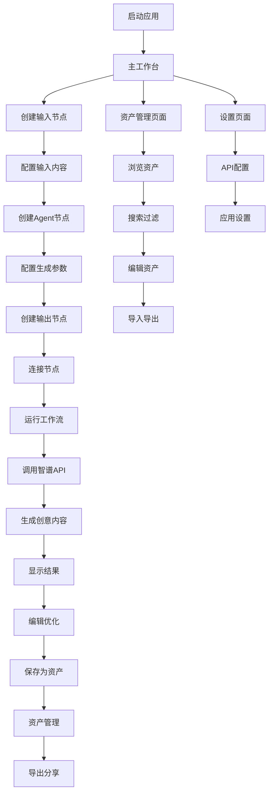

# AidCreater 完整产品需求文档（PRD）

## 1. 产品概述

AidCreater是一个基于节点工作流的AI驱动创意生成工具，专为产品设计师提供灵感发散和创意生成服务。通过可视化的拖拽操作和智能化的内容生成，帮助设计师快速获得高质量的创意想法，提升创意工作效率。

- **核心价值**：将复杂的创意生成过程可视化，让AI辅助创意变得简单易用
- **目标用户**：产品设计师、创意工作者、需要灵感发散的专业人士
- **市场定位**：本地部署的专业创意工具，注重数据隐私和使用便捷性

## 2. 核心功能

### 2.1 用户角色

本产品采用单用户模式，无需复杂的权限管理：

| 角色 | 使用方式 | 核心权限 |
|------|----------|----------|
| 创意设计师 | 本地安装使用 | 创建工作流、生成创意、管理资产、配置API密钥 |

### 2.2 功能模块

我们的AidCreater包含以下核心页面：

1. **主工作台**：画布操作区域，节点库面板，工具栏控制
2. **属性编辑面板**：节点配置，参数调整，实时预览
3. **资产管理页面**：创意资产浏览，搜索过滤，导入导出
4. **设置配置页面**：API密钥配置，应用偏好设置

### 2.3 页面详细功能

| 页面名称 | 模块名称 | 功能描述 |
|----------|----------|----------|
| 主工作台 | 画布区域 | 支持节点拖拽、连接、移动、缩放、平移操作，实时显示工作流状态 |
| 主工作台 | 节点库面板 | 提供输入节点、Agent节点、输出节点的拖拽模板，支持节点搜索 |
| 主工作台 | 工具栏 | 工作流运行控制、保存加载、导入导出、画布操作工具 |
| 主工作台 | 状态栏 | 显示当前执行状态、进度信息、错误提示、性能监控 |
| 属性面板 | 节点配置器 | 编辑选中节点的参数、提示词模板、输出格式等配置 |
| 属性面板 | 内容编辑器 | 查看和编辑节点的输入输出内容，支持文本格式化 |
| 属性面板 | 实时预览 | 显示节点执行结果，支持流式内容更新 |
| 资产管理 | 资产浏览器 | 网格或列表方式浏览已保存的创意资产，支持缩略图预览 |
| 资产管理 | 搜索过滤器 | 按标题、标签、创建时间等条件搜索和过滤资产 |
| 资产管理 | 资产编辑器 | 编辑资产标题、内容、标签等元信息 |
| 资产管理 | 导入导出 | 支持JSON、Markdown格式的资产导入导出 |
| 设置页面 | API配置 | 智谱AI API密钥配置、连接测试、使用量查看 |
| 设置页面 | 应用设置 | 主题切换、自动保存、性能优化等偏好设置 |

## 3. 核心流程

### 3.1 主要用户操作流程

**创意生成流程**：
1. 用户启动应用，进入主工作台
2. 从节点库拖拽"输入节点"到画布，输入品类或需求描述
3. 拖拽"Agent节点"到画布，配置生成参数和提示词模板
4. 拖拽"输出节点"到画布，设置结果展示格式
5. 使用连接线将三个节点按顺序连接
6. 点击运行按钮，系统调用智谱API生成创意内容
7. 在属性面板查看生成结果，可进行编辑和优化
8. 将满意的创意保存为资产，添加标签便于管理

**资产管理流程**：
1. 进入资产管理页面，浏览已保存的创意
2. 使用搜索和过滤功能快速定位目标资产
3. 选择资产进行查看、编辑或删除操作
4. 将有价值的资产导出为文件，便于分享和备份
5. 从资产创建新的工作流节点，实现创意的复用和迭代

### 3.2 系统流程图



## 4. 用户界面设计

### 4.1 设计风格

**色彩方案**：
- 主色调：#1890ff（科技蓝）
- 辅助色：#52c41a（成功绿）、#faad14（警告橙）、#f5222d（错误红）
- 背景色：#f0f2f5（浅灰）、#ffffff（纯白）
- 文字色：#262626（深灰）、#595959（中灰）、#8c8c8c（浅灰）

**组件风格**：
- 按钮：圆角4px，支持主要、次要、文本三种类型
- 卡片：圆角8px，阴影效果，突出层次感
- 输入框：圆角6px，聚焦时蓝色边框
- 图标：线性风格，统一使用Ant Design图标库

**字体规范**：
- 主标题：16px，字重600，行高24px
- 副标题：14px，字重500，行高22px
- 正文：14px，字重400，行高22px
- 辅助文字：12px，字重400，行高20px

**布局风格**：
- 采用左右分栏布局，左侧画布区域占70%，右侧属性面板占30%
- 顶部工具栏高度48px，底部状态栏高度32px
- 组件间距遵循8px网格系统
- 支持面板拖拽调整大小

### 4.2 页面设计概览

| 页面名称 | 模块名称 | UI元素描述 |
|----------|----------|------------|
| 主工作台 | 画布区域 | 深色背景网格，节点采用卡片样式，连接线为蓝色曲线，支持缩放和平移操作 |
| 主工作台 | 节点库面板 | 左侧抽屉式面板，节点图标采用不同颜色区分类型，支持拖拽到画布 |
| 主工作台 | 工具栏 | 顶部横向布局，包含运行按钮（绿色）、停止按钮（红色）、保存按钮等 |
| 主工作台 | 状态栏 | 底部信息栏，显示执行状态、节点数量、连接数量等统计信息 |
| 属性面板 | 节点配置 | 右侧面板，表单样式，包含输入框、下拉选择、滑块等控件 |
| 属性面板 | 内容编辑 | 文本编辑器样式，支持语法高亮，工具栏包含格式化按钮 |
| 资产管理 | 资产网格 | 卡片网格布局，每个资产显示缩略图、标题、创建时间和标签 |
| 资产管理 | 搜索栏 | 顶部搜索框，支持实时搜索，右侧过滤器按钮 |
| 设置页面 | 配置表单 | 标准表单布局，左侧标签右侧输入框，重要配置项有说明文字 |

### 4.3 响应式设计

**桌面优先设计**：
- 主要针对1920x1080及以上分辨率优化
- 最小支持分辨率1366x768
- 支持4K高分屏的高DPI适配

**布局适配**：
- 窗口宽度<1200px时，右侧面板可折叠
- 窗口高度<600px时，工具栏和状态栏可隐藏
- 支持全屏模式，最大化画布操作空间

**交互优化**：
- 鼠标操作为主，支持键盘快捷键
- 拖拽操作有视觉反馈和吸附效果
- 长时间操作显示进度条和取消按钮

## 5. 技术规格

### 5.1 系统架构

**技术栈**：
- 前端：React 18 + TypeScript + React Flow + Ant Design + Zustand
- 后端：Node.js + Express + 智谱AI SDK
- 数据库：SQLite（本地存储）
- 打包：Electron + Electron Builder

**架构模式**：
- 分层架构：UI层 → 业务层 → 服务层 → 数据层
- 组件化设计：可复用的React组件
- 状态管理：Zustand全局状态 + React本地状态
- 事件驱动：基于事件的节点通信机制

### 5.2 性能指标

**响应时间**：
- 应用启动时间：< 5秒
- 界面操作响应：< 100毫秒
- API调用超时：30秒
- 工作流执行：根据节点数量和API响应时间

**资源使用**：
- 内存占用：< 500MB
- 磁盘空间：应用包< 200MB，数据存储< 1GB
- CPU使用：空闲时< 5%，执行时< 50%

**并发限制**：
- 同时API调用：最多3个
- 工作流节点：单个工作流最多20个
- 资产数量：最多1000个

### 5.3 兼容性要求

**操作系统**：
- Windows 10及以上版本
- macOS 10.15及以上版本
- Ubuntu 18.04及以上版本

**硬件要求**：
- 内存：最低4GB，推荐8GB
- 存储：最低2GB可用空间
- 网络：需要互联网连接调用智谱API

## 6. 数据模型

### 6.1 核心数据结构

**节点数据模型**：
```typescript
interface Node {
  id: string;                    // 唯一标识
  type: 'input' | 'agent' | 'output'; // 节点类型
  position: { x: number; y: number };  // 画布位置
  data: {
    label: string;               // 显示名称
    content?: string;            // 节点内容
    config?: {
      promptTemplate?: string;   // 提示词模板
      temperature?: number;      // 生成温度
      maxTokens?: number;        // 最大令牌数
    };
  };
  createdAt: Date;
  updatedAt: Date;
}
```

**工作流数据模型**：
```typescript
interface Workflow {
  id: string;
  name: string;
  description?: string;
  nodes: Node[];
  edges: Edge[];
  status: 'draft' | 'running' | 'completed' | 'error';
  createdAt: Date;
  updatedAt: Date;
  lastExecutedAt?: Date;
}
```

**资产数据模型**：
```typescript
interface Asset {
  id: string;
  title: string;
  content: string;
  type: 'idea' | 'concept' | 'design' | 'text';
  tags: string[];
  workflowId?: string;          // 来源工作流
  nodeId?: string;              // 来源节点
  createdAt: Date;
  updatedAt: Date;
  metadata?: {
    wordCount?: number;
    language?: string;
    quality?: number;
  };
}
```

### 6.2 数据存储方案

**本地数据库**：
- 使用SQLite存储结构化数据
- 工作流、节点、资产等核心数据
- 支持事务和数据完整性约束

**文件系统**：
- 配置文件：JSON格式存储用户设置
- 日志文件：文本格式记录操作日志
- 导出文件：支持JSON和Markdown格式

**数据备份**：
- 自动备份：每日自动备份数据库
- 手动导出：用户可随时导出所有数据
- 数据恢复：支持从备份文件恢复数据

## 7. 安全和隐私

### 7.1 数据安全

**本地存储**：
- 所有用户数据存储在本地，不上传到云端
- API密钥使用AES加密存储
- 敏感配置文件设置适当的文件权限

**网络安全**：
- 仅与智谱AI API进行HTTPS通信
- 不收集用户行为数据
- 不包含第三方追踪代码

### 7.2 隐私保护

**数据最小化**：
- 只收集必要的功能数据
- 不收集个人身份信息
- 用户可随时删除所有本地数据

**透明度**：
- 明确说明数据使用方式
- 提供详细的隐私政策
- 用户对数据有完全控制权

## 8. 部署和维护

### 8.1 安装部署

**安装包分发**：
- Windows：.exe安装程序
- macOS：.dmg磁盘镜像
- Linux：.AppImage便携应用

**安装流程**：
1. 下载对应平台的安装包
2. 运行安装程序，选择安装路径
3. 首次启动时配置智谱API密钥
4. 完成初始化设置，开始使用

### 8.2 更新维护

**自动更新**：
- 应用启动时检查更新
- 后台下载更新包
- 用户确认后安装更新

**手动更新**：
- 提供手动检查更新功能
- 支持跳过特定版本
- 更新日志详细说明变更内容

## 9. 用户支持

### 9.1 帮助文档

**内置帮助**：
- 应用内帮助页面
- 功能引导和提示
- 常见问题解答

**在线文档**：
- 详细的用户手册
- 视频教程和演示
- 最佳实践指南

### 9.2 技术支持

**问题反馈**：
- 应用内反馈功能
- GitHub Issues跟踪
- 邮件技术支持

**社区支持**：
- 用户交流群组
- 经验分享论坛
- 定期的用户调研

## 10. 发布计划

### 10.1 版本规划

**v1.0 MVP版本**（目标：33天）：
- 基础节点系统和工作流执行
- 智谱API集成和创意生成
- 本地资产管理和导出功能
- 跨平台桌面应用打包

**v1.1 优化版本**（v1.0后4周）：
- 性能优化和bug修复
- 用户体验改进
- 更多节点类型支持

**v2.0 增强版本**（v1.1后8周）：
- 高级工作流功能（分支、循环）
- 插件系统和扩展机制
- 更丰富的资产管理功能

### 10.2 成功指标

**技术指标**：
- 应用稳定性：崩溃率< 0.1%
- 性能表现：满足所有性能要求
- 兼容性：支持目标平台100%

**用户指标**：
- 用户满意度：> 4.5分（5分制）
- 功能完成率：> 90%用户能完成核心流程
- 留存率：7天留存> 60%

**业务指标**：
- 按时交付：在33天内完成MVP版本
- 质量达标：通过所有验收测试
- 用户反馈：收集并分析用户使用反馈

---

**文档版本**: v1.0  
**创建时间**: 2024年  
**文档状态**: 完整版本  
**负责人**: AI产品经理  
**审核状态**: 待最终确认