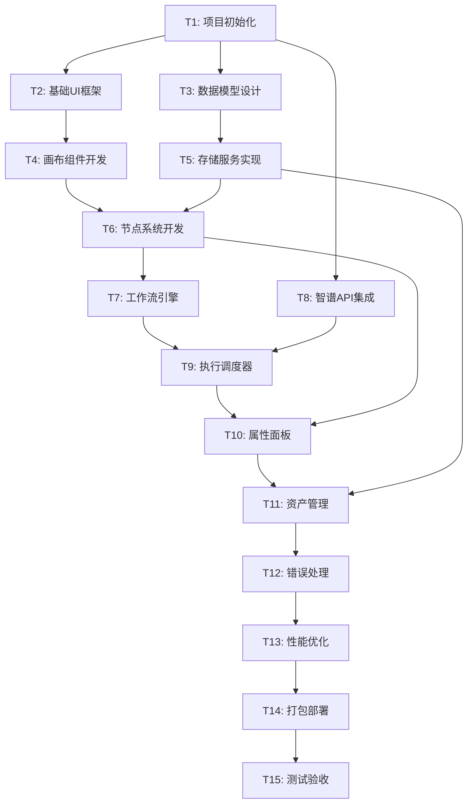

# AidCreater 原子任务分解文档 (TASK)

## 1. 任务总览

基于系统架构设计，将AidCreater项目拆分为以下原子任务，确保每个任务都具有明确的输入输出契约和验收标准。

### 1.1 任务依赖关系图

## 2. 原子任务详细定义

### T1: 项目初始化和环境搭建

**任务描述**: 创建项目基础结构，配置开发环境和构建工具

**输入契约**:
- 前置依赖: Node.js 18+环境
- 输入数据: 项目需求规格
- 环境依赖: Git, npm/yarn

**输出契约**:
- 输出数据: 完整的项目脚手架
- 交付物: 
  - package.json配置文件
  - TypeScript配置
  - Vite构建配置
  - ESLint和Prettier配置
  - 基础目录结构
- 验收标准: 
  - `npm install`成功执行
  - `npm run dev`启动开发服务器
  - TypeScript编译无错误

**实现约束**:
- 技术栈: React 18 + TypeScript + Vite
- 代码规范: ESLint + Prettier
- 质量要求: 所有配置文件有注释说明

**依赖关系**: 无前置任务

---

### T2: 基础UI框架搭建

**任务描述**: 搭建应用的基础UI框架和布局组件

**输入契约**:
- 前置依赖: T1完成
- 输入数据: UI设计规范
- 环境依赖: React, Ant Design

**输出契约**:
- 输出数据: 基础布局组件
- 交付物:
  - 主布局组件 (MainLayout)
  - 头部工具栏组件 (Toolbar)
  - 侧边栏组件 (Sidebar)
  - 状态栏组件 (StatusBar)
  - 基础路由配置
- 验收标准:
  - 布局响应式适配
  - 组件可正常渲染
  - 支持主题切换

**实现约束**:
- UI库: Ant Design 5.x
- 样式方案: CSS Modules + Less
- 响应式: 支持1920x1080及以上分辨率

**依赖关系**: T1 → T2

---

### T3: 数据模型设计和实现

**任务描述**: 设计和实现核心数据模型，包括节点、工作流、资产等

**输入契约**:
- 前置依赖: T1完成
- 输入数据: 数据模型设计文档
- 环境依赖: TypeScript

**输出契约**:
- 输出数据: 完整的类型定义
- 交付物:
  - 节点类型定义 (types/node.ts)
  - 工作流类型定义 (types/workflow.ts)
  - 资产类型定义 (types/asset.ts)
  - 执行上下文类型 (types/execution.ts)
  - 数据验证函数
- 验收标准:
  - 所有类型定义完整
  - 通过TypeScript类型检查
  - 包含完整的JSDoc注释

**实现约束**:
- 类型安全: 严格的TypeScript类型
- 验证: 使用Zod进行运行时验证
- 文档: 完整的类型注释

**依赖关系**: T1 → T3

---

### T4: 画布组件开发

**任务描述**: 基于React Flow开发可拖拽的画布组件

**输入契约**:
- 前置依赖: T2完成
- 输入数据: 画布交互设计
- 环境依赖: React Flow库

**输出契约**:
- 输出数据: 可交互的画布组件
- 交付物:
  - 画布容器组件 (Canvas)
  - 节点拖拽处理
  - 连接线绘制
  - 缩放和平移功能
  - 选择和多选功能
- 验收标准:
  - 支持节点拖拽和移动
  - 支持节点连接
  - 支持画布缩放和平移
  - 性能流畅，无明显卡顿

**实现约束**:
- 拖拽库: React Flow 11.x
- 性能: 支持100+节点流畅操作
- 交互: 符合用户习惯的操作方式

**依赖关系**: T2 → T4

---

### T5: 存储服务实现

**任务描述**: 实现本地数据存储服务，支持工作流和资产的持久化

**输入契约**:
- 前置依赖: T3完成
- 输入数据: 存储需求规格
- 环境依赖: SQLite, Node.js

**输出契约**:
- 输出数据: 完整的存储服务
- 交付物:
  - 数据库初始化脚本
  - 存储服务类 (StorageService)
  - 数据访问层 (DAO)
  - 数据迁移脚本
  - 备份恢复功能
- 验收标准:
  - 数据CRUD操作正常
  - 支持事务处理
  - 数据完整性验证
  - 性能满足要求

**实现约束**:
- 数据库: SQLite 3.x
- ORM: 原生SQL + 类型安全封装
- 备份: JSON格式导出导入

**依赖关系**: T3 → T5

---

### T6: 节点系统开发

**任务描述**: 开发三种核心节点类型和节点管理系统

**输入契约**:
- 前置依赖: T4, T5完成
- 输入数据: 节点功能规格
- 环境依赖: React, 存储服务

**输出契约**:
- 输出数据: 完整的节点系统
- 交付物:
  - 节点基类 (BaseNode)
  - 输入节点组件 (InputNode)
  - Agent节点组件 (AgentNode)
  - 输出节点组件 (OutputNode)
  - 节点管理器 (NodeManager)
  - 节点库组件 (NodeLibrary)
- 验收标准:
  - 三种节点类型功能完整
  - 节点可正常创建和删除
  - 节点数据可持久化
  - 节点渲染性能良好

**实现约束**:
- 组件化: 每种节点独立组件
- 可扩展: 支持未来新增节点类型
- 性能: 大量节点时渲染流畅

**依赖关系**: T4, T5 → T6

---

### T7: 工作流引擎开发

**任务描述**: 开发工作流的验证、解析和执行引擎

**输入契约**:
- 前置依赖: T6完成
- 输入数据: 工作流执行规则
- 环境依赖: 节点系统

**输出契约**:
- 输出数据: 工作流执行引擎
- 交付物:
  - 工作流引擎类 (WorkflowEngine)
  - 工作流验证器 (WorkflowValidator)
  - 执行计划生成器 (ExecutionPlanner)
  - 依赖解析器 (DependencyResolver)
- 验收标准:
  - 工作流验证准确
  - 执行顺序正确
  - 错误处理完善
  - 支持中断和恢复

**实现约束**:
- 算法: 拓扑排序确定执行顺序
- 错误处理: 完善的异常捕获和恢复
- 状态管理: 实时的执行状态跟踪

**依赖关系**: T6 → T7

---

### T8: 智谱API集成

**任务描述**: 集成智谱AI API，实现内容生成功能

**输入契约**:
- 前置依赖: T1完成
- 输入数据: 智谱API文档
- 环境依赖: 智谱AI SDK

**输出契约**:
- 输出数据: API集成服务
- 交付物:
  - 智谱服务类 (ZhipuService)
  - API配置管理 (ApiConfig)
  - 请求重试机制
  - 流式响应处理
  - 错误处理和降级
- 验收标准:
  - API调用成功率>95%
  - 支持流式响应
  - 错误处理完善
  - API密钥安全存储

**实现约束**:
- SDK: 智谱AI官方SDK
- 安全: API密钥本地加密存储
- 性能: 支持并发调用限制

**依赖关系**: T1 → T8

---

### T9: 执行调度器开发

**任务描述**: 开发任务调度和执行监控系统

**输入契约**:
- 前置依赖: T7, T8完成
- 输入数据: 调度策略规格
- 环境依赖: 工作流引擎, API服务

**输出契约**:
- 输出数据: 执行调度系统
- 交付物:
  - 执行调度器 (ExecutionScheduler)
  - 任务队列管理 (TaskQueue)
  - 执行监控器 (ExecutionMonitor)
  - 进度报告器 (ProgressReporter)
- 验收标准:
  - 任务调度准确
  - 执行状态实时更新
  - 支持任务取消
  - 并发控制有效

**实现约束**:
- 并发: 最多3个并发API调用
- 监控: 实时的执行状态反馈
- 容错: 失败任务自动重试

**依赖关系**: T7, T8 → T9

---

### T10: 属性面板开发

**任务描述**: 开发节点属性编辑和配置面板

**输入契约**:
- 前置依赖: T6, T9完成
- 输入数据: 属性面板设计
- 环境依赖: UI组件库

**输出契约**:
- 输出数据: 属性编辑面板
- 交付物:
  - 属性面板组件 (PropertyPanel)
  - 表单验证器 (FormValidator)
  - 配置编辑器 (ConfigEditor)
  - 实时预览功能
- 验收标准:
  - 支持所有节点类型配置
  - 表单验证准确
  - 实时保存和预览
  - 用户体验良好

**实现约束**:
- 表单: Ant Design Form组件
- 验证: 实时验证和错误提示
- 性能: 大量配置项时流畅操作

**依赖关系**: T6, T9 → T10

---

### T11: 资产管理系统

**任务描述**: 开发创意资产的保存、管理和分享功能

**输入契约**:
- 前置依赖: T5, T10完成
- 输入数据: 资产管理需求
- 环境依赖: 存储服务

**输出契约**:
- 输出数据: 资产管理系统
- 交付物:
  - 资产管理器 (AssetManager)
  - 资产浏览器 (AssetBrowser)
  - 资产编辑器 (AssetEditor)
  - 导出导入功能
  - 搜索和标签系统
- 验收标准:
  - 资产CRUD操作完整
  - 支持搜索和过滤
  - 导出导入功能正常
  - 标签管理有效

**实现约束**:
- 搜索: 全文搜索和标签过滤
- 导出: JSON和Markdown格式
- 性能: 大量资产时加载流畅

**依赖关系**: T5, T10 → T11

---

### T12: 错误处理和日志系统

**任务描述**: 实现全局错误处理和日志记录系统

**输入契约**:
- 前置依赖: T11完成
- 输入数据: 错误处理策略
- 环境依赖: 完整应用系统

**输出契约**:
- 输出数据: 错误处理系统
- 交付物:
  - 全局错误边界 (ErrorBoundary)
  - 错误恢复管理器 (ErrorRecoveryManager)
  - 日志记录器 (Logger)
  - 用户友好的错误提示
- 验收标准:
  - 所有错误都有处理
  - 错误信息用户友好
  - 日志记录完整
  - 支持错误恢复

**实现约束**:
- 覆盖: 全局错误捕获
- 用户体验: 友好的错误提示
- 调试: 详细的开发者日志

**依赖关系**: T11 → T12

---

### T13: 性能优化

**任务描述**: 对应用进行全面的性能优化

**输入契约**:
- 前置依赖: T12完成
- 输入数据: 性能基准测试
- 环境依赖: 完整应用

**输出契约**:
- 输出数据: 优化后的应用
- 交付物:
  - 代码分割和懒加载
  - 虚拟化渲染
  - 缓存策略优化
  - 内存泄漏修复
  - 性能监控工具
- 验收标准:
  - 启动时间<5秒
  - 操作响应时间<100ms
  - 内存使用<500MB
  - 支持100+节点流畅操作

**实现约束**:
- 目标: 满足性能验收标准
- 工具: React DevTools, Chrome DevTools
- 监控: 性能指标实时监控

**依赖关系**: T12 → T13

---

### T14: 打包和部署

**任务描述**: 配置Electron打包和跨平台部署

**输入契约**:
- 前置依赖: T13完成
- 输入数据: 部署需求
- 环境依赖: Electron, Electron Builder

**输出契约**:
- 输出数据: 可分发的应用包
- 交付物:
  - Electron主进程配置
  - 打包配置文件
  - 安装包生成脚本
  - 自动更新机制
  - 跨平台兼容性测试
- 验收标准:
  - 支持Windows/macOS/Linux
  - 安装包大小<200MB
  - 一键安装和启动
  - 自动更新功能正常

**实现约束**:
- 打包工具: Electron Builder
- 签名: 代码签名和公证
- 分发: 支持多平台分发

**依赖关系**: T13 → T14

---

### T15: 测试和验收

**任务描述**: 进行全面的功能测试和用户验收测试

**输入契约**:
- 前置依赖: T14完成
- 输入数据: 测试用例和验收标准
- 环境依赖: 完整应用包

**输出契约**:
- 输出数据: 测试报告和验收文档
- 交付物:
  - 单元测试套件
  - 集成测试套件
  - E2E测试套件
  - 性能测试报告
  - 用户验收测试报告
- 验收标准:
  - 测试覆盖率>80%
  - 所有功能测试通过
  - 性能指标达标
  - 用户验收通过

**实现约束**:
- 测试框架: Jest + React Testing Library
- E2E测试: Playwright
- 覆盖率: 核心功能100%覆盖

**依赖关系**: T14 → T15

## 3. 任务执行计划

### 3.1 时间安排

| 任务 | 预估工期 | 开始时间 | 结束时间 | 负责人 |
|------|----------|----------|----------|--------|
| T1 | 1天 | Day 1 | Day 1 | 架构师 |
| T2 | 2天 | Day 2 | Day 3 | 前端开发 |
| T3 | 2天 | Day 2 | Day 3 | 架构师 |
| T4 | 3天 | Day 4 | Day 6 | 前端开发 |
| T5 | 3天 | Day 4 | Day 6 | 后端开发 |
| T6 | 4天 | Day 7 | Day 10 | 前端开发 |
| T7 | 3天 | Day 11 | Day 13 | 架构师 |
| T8 | 2天 | Day 2 | Day 3 | 后端开发 |
| T9 | 3天 | Day 14 | Day 16 | 后端开发 |
| T10 | 3天 | Day 17 | Day 19 | 前端开发 |
| T11 | 4天 | Day 20 | Day 23 | 全栈开发 |
| T12 | 2天 | Day 24 | Day 25 | 架构师 |
| T13 | 3天 | Day 26 | Day 28 | 全栈开发 |
| T14 | 2天 | Day 29 | Day 30 | DevOps |
| T15 | 3天 | Day 31 | Day 33 | QA + 全员 |

### 3.2 关键里程碑

- **里程碑1** (Day 6): 基础框架完成
- **里程碑2** (Day 13): 核心功能完成
- **里程碑3** (Day 23): 功能完整版本
- **里程碑4** (Day 30): 可发布版本
- **里程碑5** (Day 33): 正式发布版本

### 3.3 风险控制

**高风险任务**:
- T4 (画布组件): React Flow学习曲线
- T8 (智谱API): API稳定性和限流
- T9 (执行调度): 并发控制复杂度

**缓解措施**:
- 提前技术预研和原型验证
- 准备备选方案和降级策略
- 增加缓冲时间和人力投入

---

**文档状态**: 任务分解完成  
**创建时间**: 2024年  
**分解人**: AI架构师  
**版本**: v1.0  
**审核状态**: 待项目经理确认