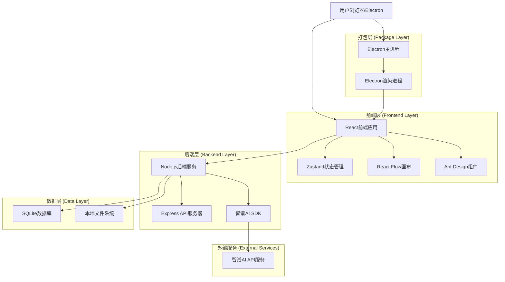
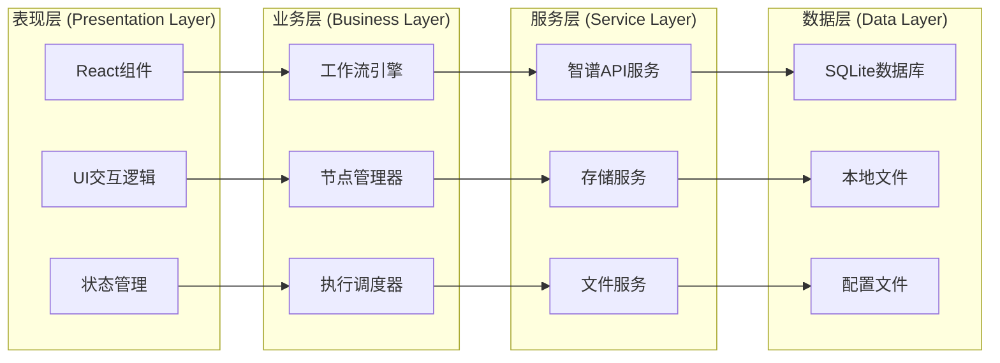
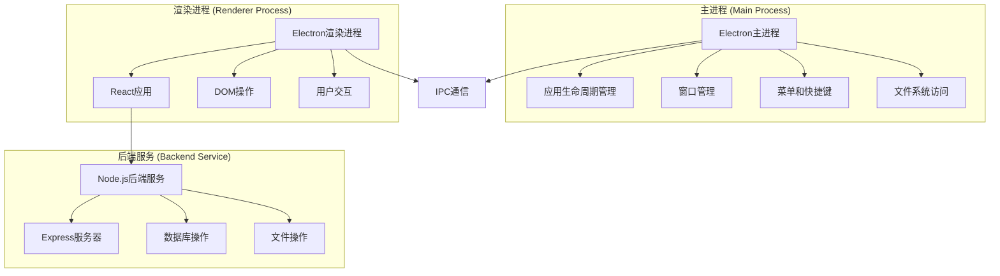
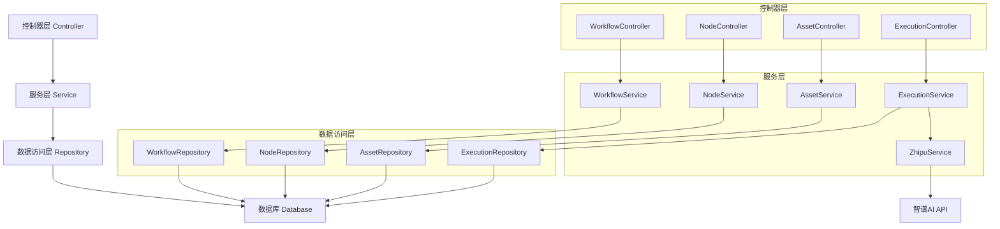
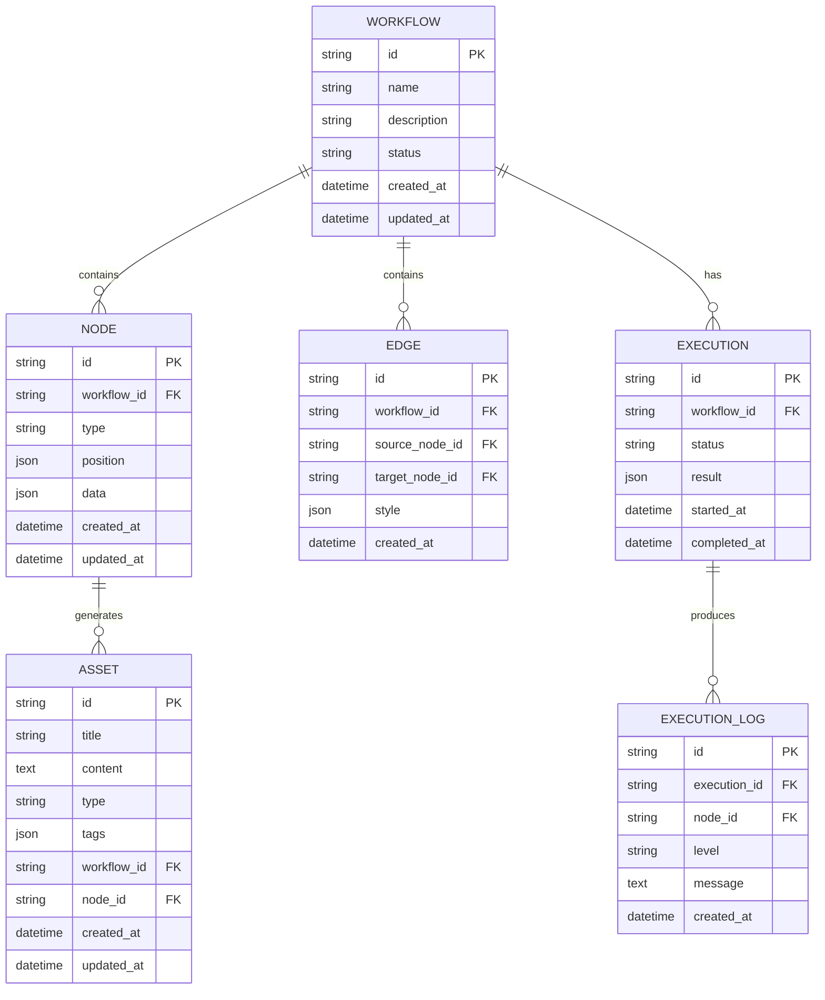

# AidCreater 技术架构文档

## 1. 架构设计

### 1.1 整体架构图



### 1.2 分层架构详述



## 2. 技术描述

### 2.1 核心技术栈

**前端技术栈**:

* React\@18.2.0 - 用户界面框架

* TypeScript\@5.0.0 - 类型安全的JavaScript

* React Flow\@11.10.0 - 节点编辑器和流程图

* Ant Design\@5.8.0 - UI组件库

* Zustand\@4.4.0 - 轻量级状态管理

* Vite\@4.4.0 - 构建工具和开发服务器

**后端技术栈**:

* Node.js\@18.17.0 - JavaScript运行时

* Express\@4.18.0 - Web应用框架

* 智谱AI SDK\@latest - 智谱AI官方SDK

* SQLite\@3.43.0 - 嵌入式数据库

* Electron\@25.0.0 - 跨平台桌面应用框架

**开发工具**:

* ESLint\@8.45.0 - 代码质量检查

* Prettier\@3.0.0 - 代码格式化

* Jest\@29.6.0 - 单元测试框架

* Playwright\@1.36.0 - 端到端测试

### 2.2 依赖关系管理

**核心依赖**:

```json
{
  "dependencies": {
    "react": "^18.2.0",
    "react-dom": "^18.2.0",
    "typescript": "^5.0.0",
    "@reactflow/core": "^11.10.0",
    "@reactflow/background": "^11.3.0",
    "@reactflow/controls": "^11.2.0",
    "antd": "^5.8.0",
    "zustand": "^4.4.0",
    "express": "^4.18.0",
    "sqlite3": "^5.1.6",
    "zhipuai": "^latest"
  },
  "devDependencies": {
    "vite": "^4.4.0",
    "@types/react": "^18.2.0",
    "@types/node": "^20.4.0",
    "eslint": "^8.45.0",
    "prettier": "^3.0.0",
    "jest": "^29.6.0",
    "electron": "^25.0.0",
    "electron-builder": "^24.6.0"
  }
}
```

## 3. 路由定义

### 3.1 前端路由结构

| 路由路径      | 组件名称          | 功能描述              |
| --------- | ------------- | ----------------- |
| /         | MainWorkspace | 主工作台，包含画布、节点库、工具栏 |
| /assets   | AssetManager  | 资产管理页面，浏览和管理创意资产  |
| /settings | SettingsPage  | 设置页面，API配置和应用偏好   |
| /help     | HelpPage      | 帮助文档和使用指南         |
| /about    | AboutPage     | 关于页面，版本信息和更新日志    |

### 3.2 路由配置

```typescript
// src/router/index.tsx
import { createBrowserRouter } from 'react-router-dom';
import MainLayout from '../components/Layout/MainLayout';
import MainWorkspace from '../pages/MainWorkspace';
import AssetManager from '../pages/AssetManager';
import SettingsPage from '../pages/SettingsPage';
import HelpPage from '../pages/HelpPage';
import AboutPage from '../pages/AboutPage';

export const router = createBrowserRouter([
  {
    path: '/',
    element: <MainLayout />,
    children: [
      {
        index: true,
        element: <MainWorkspace />
      },
      {
        path: 'assets',
        element: <AssetManager />
      },
      {
        path: 'settings',
        element: <SettingsPage />
      },
      {
        path: 'help',
        element: <HelpPage />
      },
      {
        path: 'about',
        element: <AboutPage />
      }
    ]
  }
]);
```

## 4. API定义

### 4.1 内部API接口

**工作流管理API**

```typescript
// 创建工作流
POST /api/workflows
```

请求参数:

| 参数名         | 参数类型   | 是否必需  | 描述    |
| ----------- | ------ | ----- | ----- |
| name        | string | true  | 工作流名称 |
| description | string | false | 工作流描述 |

响应数据:

| 字段名       | 字段类型   | 描述      |
| --------- | ------ | ------- |
| id        | string | 工作流唯一标识 |
| name      | string | 工作流名称   |
| createdAt | string | 创建时间    |

示例:

```json
{
  "name": "产品创意生成流程",
  "description": "基于品类生成产品创意的工作流"
}
```

**节点操作API**

```typescript
// 添加节点
POST /api/workflows/:workflowId/nodes
```

请求参数:

| 参数名      | 参数类型   | 是否必需 | 描述                        |
| -------- | ------ | ---- | ------------------------- |
| type     | string | true | 节点类型 (input/agent/output) |
| position | object | true | 节点位置坐标                    |
| data     | object | true | 节点配置数据                    |

响应数据:

| 字段名      | 字段类型   | 描述     |
| -------- | ------ | ------ |
| id       | string | 节点唯一标识 |
| type     | string | 节点类型   |
| position | object | 节点位置   |

**执行控制API**

```typescript
// 执行工作流
POST /api/workflows/:workflowId/execute
```

请求参数:

| 参数名     | 参数类型   | 是否必需  | 描述     |
| ------- | ------ | ----- | ------ |
| options | object | false | 执行选项配置 |

响应数据:

| 字段名         | 字段类型   | 描述     |
| ----------- | ------ | ------ |
| executionId | string | 执行任务ID |
| status      | string | 执行状态   |
| startTime   | string | 开始时间   |

### 4.2 智谱AI API集成

**API调用封装**

```typescript
// src/services/ZhipuService.ts
import { ZhipuAI } from 'zhipuai';

interface GenerationOptions {
  model?: string;
  temperature?: number;
  max_tokens?: number;
  stream?: boolean;
}

class ZhipuService {
  private client: ZhipuAI;
  
  constructor(apiKey: string) {
    this.client = new ZhipuAI({
      apiKey: apiKey
    });
  }
  
  async generateContent(
    prompt: string, 
    options: GenerationOptions = {}
  ): Promise<string> {
    try {
      const response = await this.client.chat.completions.create({
        model: options.model || 'glm-4',
        messages: [
          {
            role: 'user',
            content: prompt
          }
        ],
        temperature: options.temperature || 0.7,
        max_tokens: options.max_tokens || 2000,
        stream: options.stream || false
      });
      
      return response.choices[0].message.content;
    } catch (error) {
      throw new Error(`智谱AI调用失败: ${error.message}`);
    }
  }
  
  async streamGenerate(
    prompt: string,
    callback: (chunk: string) => void,
    options: GenerationOptions = {}
  ): Promise<void> {
    const stream = await this.client.chat.completions.create({
      model: options.model || 'glm-4',
      messages: [{ role: 'user', content: prompt }],
      stream: true,
      ...options
    });
    
    for await (const chunk of stream) {
      const content = chunk.choices[0]?.delta?.content || '';
      if (content) {
        callback(content);
      }
    }
  }
}
```

## 5. 服务器架构图

### 5.1 Electron进程架构



### 5.2 服务分层架构



## 6. 数据模型

### 6.1 数据模型定义



### 6.2 数据定义语言 (DDL)

**工作流表 (workflows)**

```sql
-- 创建工作流表
CREATE TABLE workflows (
    id TEXT PRIMARY KEY,
    name TEXT NOT NULL,
    description TEXT,
    status TEXT DEFAULT 'draft' CHECK (status IN ('draft', 'running', 'completed', 'error')),
    created_at DATETIME DEFAULT CURRENT_TIMESTAMP,
    updated_at DATETIME DEFAULT CURRENT_TIMESTAMP
);

-- 创建索引
CREATE INDEX idx_workflows_status ON workflows(status);
CREATE INDEX idx_workflows_created_at ON workflows(created_at DESC);
```

**节点表 (nodes)**

```sql
-- 创建节点表
CREATE TABLE nodes (
    id TEXT PRIMARY KEY,
    workflow_id TEXT NOT NULL,
    type TEXT NOT NULL CHECK (type IN ('input', 'agent', 'output')),
    position TEXT NOT NULL, -- JSON格式存储位置信息
    data TEXT NOT NULL,     -- JSON格式存储节点数据
    created_at DATETIME DEFAULT CURRENT_TIMESTAMP,
    updated_at DATETIME DEFAULT CURRENT_TIMESTAMP,
    FOREIGN KEY (workflow_id) REFERENCES workflows(id) ON DELETE CASCADE
);

-- 创建索引
CREATE INDEX idx_nodes_workflow_id ON nodes(workflow_id);
CREATE INDEX idx_nodes_type ON nodes(type);
```

**连接表 (edges)**

```sql
-- 创建连接表
CREATE TABLE edges (
    id TEXT PRIMARY KEY,
    workflow_id TEXT NOT NULL,
    source_node_id TEXT NOT NULL,
    target_node_id TEXT NOT NULL,
    style TEXT, -- JSON格式存储样式信息
    created_at DATETIME DEFAULT CURRENT_TIMESTAMP,
    FOREIGN KEY (workflow_id) REFERENCES workflows(id) ON DELETE CASCADE,
    FOREIGN KEY (source_node_id) REFERENCES nodes(id) ON DELETE CASCADE,
    FOREIGN KEY (target_node_id) REFERENCES nodes(id) ON DELETE CASCADE
);

-- 创建索引
CREATE INDEX idx_edges_workflow_id ON edges(workflow_id);
CREATE INDEX idx_edges_source_node ON edges(source_node_id);
CREATE INDEX idx_edges_target_node ON edges(target_node_id);
```

**资产表 (assets)**

```sql
-- 创建资产表
CREATE TABLE assets (
    id TEXT PRIMARY KEY,
    title TEXT NOT NULL,
    content TEXT NOT NULL,
    type TEXT DEFAULT 'idea' CHECK (type IN ('idea', 'concept', 'design', 'text')),
    tags TEXT, -- JSON数组格式存储标签
    workflow_id TEXT,
    node_id TEXT,
    created_at DATETIME DEFAULT CURRENT_TIMESTAMP,
    updated_at DATETIME DEFAULT CURRENT_TIMESTAMP,
    FOREIGN KEY (workflow_id) REFERENCES workflows(id) ON DELETE SET NULL,
    FOREIGN KEY (node_id) REFERENCES nodes(id) ON DELETE SET NULL
);

-- 创建索引
CREATE INDEX idx_assets_type ON assets(type);
CREATE INDEX idx_assets_created_at ON assets(created_at DESC);
CREATE INDEX idx_assets_workflow_id ON assets(workflow_id);

-- 创建全文搜索索引
CREATE VIRTUAL TABLE assets_fts USING fts5(
    title, content, tags,
    content='assets',
    content_rowid='rowid'
);
```

**执行记录表 (executions)**

```sql
-- 创建执行记录表
CREATE TABLE executions (
    id TEXT PRIMARY KEY,
    workflow_id TEXT NOT NULL,
    status TEXT DEFAULT 'pending' CHECK (status IN ('pending', 'running', 'completed', 'failed', 'cancelled')),
    result TEXT, -- JSON格式存储执行结果
    error_message TEXT,
    started_at DATETIME DEFAULT CURRENT_TIMESTAMP,
    completed_at DATETIME,
    FOREIGN KEY (workflow_id) REFERENCES workflows(id) ON DELETE CASCADE
);

-- 创建索引
CREATE INDEX idx_executions_workflow_id ON executions(workflow_id);
CREATE INDEX idx_executions_status ON executions(status);
CREATE INDEX idx_executions_started_at ON executions(started_at DESC);
```

**执行日志表 (execution\_logs)**

```sql
-- 创建执行日志表
CREATE TABLE execution_logs (
    id TEXT PRIMARY KEY,
    execution_id TEXT NOT NULL,
    node_id TEXT,
    level TEXT DEFAULT 'info' CHECK (level IN ('debug', 'info', 'warn', 'error')),
    message TEXT NOT NULL,
    created_at DATETIME DEFAULT CURRENT_TIMESTAMP,
    FOREIGN KEY (execution_id) REFERENCES executions(id) ON DELETE CASCADE,
    FOREIGN KEY (node_id) REFERENCES nodes(id) ON DELETE SET NULL
);

-- 创建索引
CREATE INDEX idx_execution_logs_execution_id ON execution_logs(execution_id);
CREATE INDEX idx_execution_logs_level ON execution_logs(level);
CREATE INDEX idx_execution_logs_created_at ON execution_logs(created_at DESC);
```

**初始化数据**

```sql
-- 插入示例工作流
INSERT INTO workflows (id, name, description, status) VALUES 
('workflow_001', '产品创意生成', '基于品类输入生成产品创意的基础工作流', 'draft'),
('workflow_002', '内容优化流程', '对已有内容进行优化和改进的工作流', 'draft');

-- 插入示例节点
INSERT INTO nodes (id, workflow_id, type, position, data) VALUES 
('node_001', 'workflow_001', 'input', '{"x": 100, "y": 100}', '{"label": "品类输入", "content": ""}'),
('node_002', 'workflow_001', 'agent', '{"x": 300, "y": 100}', '{"label": "创意生成", "config": {"temperature": 0.7}}'),
('node_003', 'workflow_001', 'output', '{"x": 500, "y": 100}', '{"label": "结果输出", "content": ""}');

-- 插入示例连接
INSERT INTO edges (id, workflow_id, source_node_id, target_node_id) VALUES 
('edge_001', 'workflow_001', 'node_001', 'node_002'),
('edge_002', 'workflow_001', 'node_002', 'node_003');
```

### 6.3 配置文件结构

**应用配置 (config.json)**

```json
{
  "app": {
    "version": "1.0.0",
    "theme": "light",
    "language": "zh-CN",
    "autoSave": true,
    "autoSaveInterval": 30000
  },
  "api": {
    "zhipu": {
      "baseUrl": "https://open.bigmodel.cn/api/paas/v4/",
      "model": "glm-4",
      "timeout": 30000,
      "retryCount": 3
    }
  },
  "performance": {
    "maxConcurrentRequests": 3,
    "maxNodesPerWorkflow": 20,
    "maxAssetsCount": 1000
  },
  "storage": {
    "dataPath": "./data",
    "backupPath": "./backups",
    "maxBackupCount": 10
  }
}
```

***

**文档版本**: v1.0\
**创建时间**: 2024年\
**文档状态**: 技术架构完成\
**负责人**: AI架构师\
**审核状态**: 待技术评审
